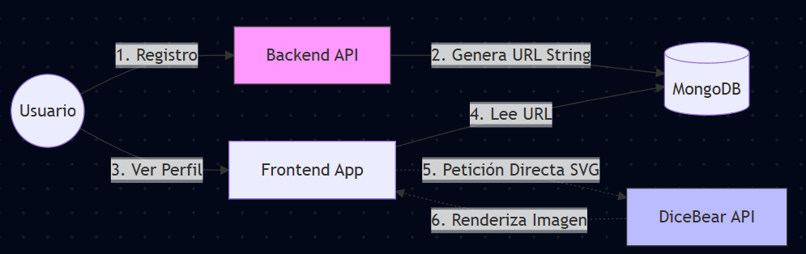

## Análisis Justificativo de la Suscripción Óptima de APIs Externas (DiceBear)

### 1. Contexto y Necesidad: Experiencia de Usuario (UX)
El objetivo es garantizar una estética profesional y una identidad visual coherente desde la primera interacción del usuario con la plataforma.

* **El Problema (Visual Cold Start)**: En el proceso de alta, la ausencia de una imagen de perfil genera una interfaz visualmente pobre ("placeholders" genéricos) que impacta negativamente en la percepción de calidad del producto.
* **La Restricción (Fricción en Onboarding)**: Obligar al usuario a buscar y subir una fotografía durante el registro aumenta drásticamente la carga cognitiva y la tasa de abandono. El proceso debe ser fluido (*frictionless*).
* **La Solución**: Implementación de **Avatares Deterministas**. Se asigna automáticamente una identidad visual única y colorida basada en una semilla (el email), eliminando el esfuerzo del usuario y garantizando un perfil completo desde el segundo cero.

### 2. Selección Tecnológica: DiceBear API
Tras evaluar distintas opciones, se ha seleccionado **DiceBear** por su alineación estratégica con la arquitectura y la temática del proyecto:

* **Coherencia de Dominio (Colección "Bottts")**: Al tratarse de un sistema de gestión de robots, la utilización de la colección de avatares robóticos refuerza la identidad de marca de forma orgánica.
* **Eficiencia Arquitectónica (Stateless)**: Es una solución sin estado. No requiere almacenamiento de blobs (imágenes) en base de datos ni procesamiento de servidor. La gestión se basa puramente en la construcción lógica de URLs.

### 3. Análisis FinOps y Optimización de Recursos
La viabilidad económica de la integración se sustenta en una estricta adhesión a las políticas de *Fair Use* y una optimización técnica basada en los límites de la API:

* **Modelo de Costes**: La implementación opera bajo licencia de código abierto con un coste operativo de **0€** para uso no comercial.
* **Optimización de Throughput (Rate Limits)**:
    * La API limita las peticiones de imágenes rasterizadas (JPG) a **10 req/s**.
    * Sin embargo, para imágenes vectoriales (**SVG**), el límite asciende a **50 req/s**.
* **Decisión Técnica**: Se ha forzado por código el uso exclusivo del formato **SVG**.
    * **Beneficio 1**: Multiplicamos por 5 la capacidad de concurrencia gratuita.
    * **Beneficio 2**: Calidad infinita (independiente de la resolución) con un peso de archivo mínimo.

### 4. Estrategia de Implementación y Mitigación
La integración se ha diseñado para ser resiliente y no introducir dependencias críticas en el backend.

#### 4.1. Matriz de Responsabilidades

| Componente | Ubicación en el Código | Responsabilidad Técnica |
| :--- | :--- | :--- |
| **Generación (Dominio)** | `src/user/domain/services/avatar-service.ts` | **Lógica Pura**. Centraliza la regla de negocio construyendo la URL de forma determinista usando el email como semilla hash: `.../bottts/svg?seed=${email}`. |
| **Persistencia** | `src/user/infrastructure/repositories/user.schema.ts` | **Eficiencia**. Se persiste únicamente la cadena de texto (URL String), optimizando el almacenamiento en MongoDB al evitar guardar archivos binarios. |
| **Validación** | `test/integration/avatar-service.spec.ts` | **QA**. Tests automatizados que aseguran que la lógica de generación produce URLs sintácticamente válidas antes del despliegue. |

#### 4.2. Mitigación de Riesgos y Ubicación Técnica
Para cumplir con los requisitos de integración backend sin comprometer la estabilidad del sistema, se ha implementado una arquitectura de **"Verificación Resiliente"**:

1. **Backend como Quality Gate (Verificación Activa)**:
   * *Ubicación*: `src/user/domain/services/avatar-service.ts`
   * *Estrategia*: A diferencia de una generación pasiva, el backend realiza una petición HTTP real (`Axios`) para validar la disponibilidad del servicio externo.
   * *Justificación*: Esto asegura que nunca persistimos en base de datos una URL rota. Aunque introduce una latencia mínima, priorizamos la **Integridad del Dato** frente a la velocidad pura.

2. **Resiliencia ante Fallos (Patrón Fallback)**:
   * *Mecanismo*: Bloque `try/catch` con Logging.
   * *Comportamiento*: Si el proveedor externo (DiceBear) sufre una caída o latencia excesiva, el servicio captura el error, registra una alerta (`Logger.warn`) y devuelve la URL calculada teóricamente.
   * *Resultado*: El sistema es **tolerante a fallos**. La caída de la API externa degrada la validación, pero **nunca bloquea** el registro de nuevos usuarios.

3. **Privacidad en Cliente**:
   * *Ubicación*: Frontend (`UserListPage.tsx`)
   * *Estrategia*: Se utiliza la directiva `referrerPolicy="no-referrer"` en la carga de imágenes para evitar que el proveedor externo rastree la navegación interna de nuestra plataforma.

### Diagrama de Flujo (Stateless)

